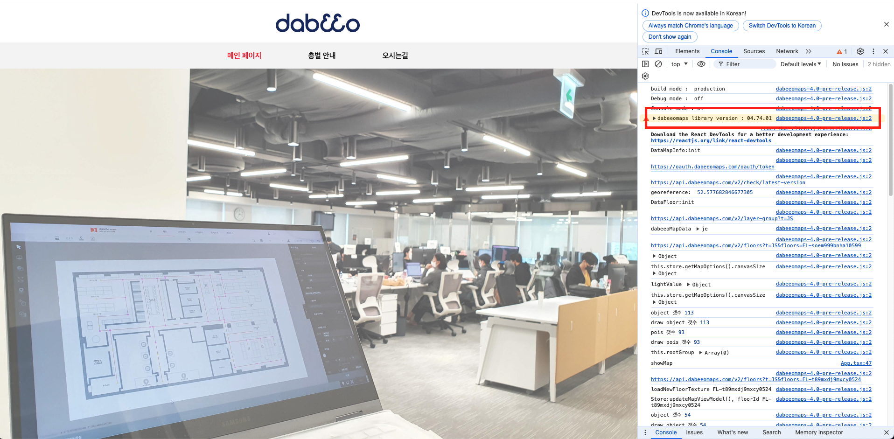

# Get Started

이 프로젝트는 dabeoomaps 4.0를 리액트, 타입스크립트 환경에서 사용한 샘플 프로젝트입니다.
CDN이나 npm install로 사용가능합니다.

### cdn link

- link: "https://api-assets.dabeeomaps.com/upload/library/dabeeomaps-04.87.01.js"

## cdn으로 설치하여 실행

```
git clone https://github.com/dabeeo/dabeeomaps_library_react_ts_sample.git
cd dabeeomaps_library_react_ts_sample
npm i
npm run dev
```

### npm으로 설치하여 실행

```
git clone https://github.com/dabeeo/dabeeomaps_library_react_ts_sample.git
cd dabeeomaps_library_react_ts_sample
git checkout npm
npm i
npm run dev
```

## 첫 화면

http://127.0.0.1:5173/ 에 접속


## 작동 화면


## 사용 library version 확인



- 개발자 모드의 console.warn 찍힌 version 확인 가능
